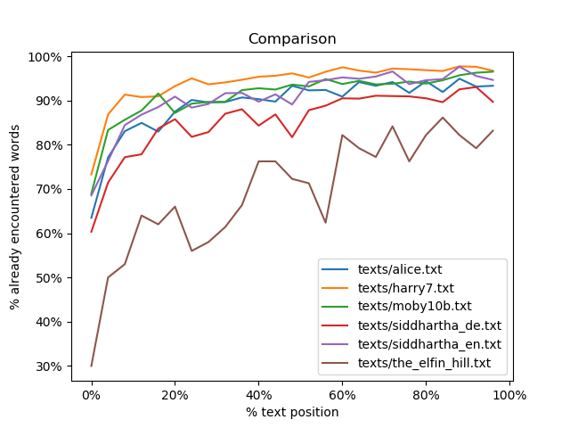
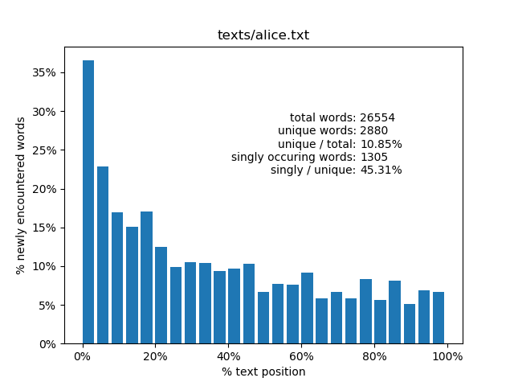

# Idionalysis

Simple tool to measure word usage in text n stuff

Made mainly to measure how useful a text might be for extensive reading!

## Example

```bash
$ ./idionalysis.py texts/*
[texts/alice.txt]
total words:                 26554
unique words:                2880
unique / total:              10.85%
singly occuring words:       1305
singly / unique:             45.31%
top 5:                       the, and, to, a, she
bottom 5:                    adding, shrieked, accidentally, declared, lesson
initial occurence breakdown: 67.88% + 32.12% = 100.0%
initial occurence breakdown: 53.26% + 26.7% + 20.03% = 100.0%
initial occurence breakdown: 45.56% + 22.33% + 16.18% + 15.94% = 100.0%
initial occurence breakdown: 40.0% + 19.38% + 15.49% + 13.19% + 11.94% = 100.0%

[texts/harry7.txt]
total words:                 200966
unique words:                11828
unique / total:              5.89%
singly occuring words:       5151
singly / unique:             43.55%
top 5:                       the, and, to, of, he
bottom 5:                    distinctive, assister, short-lived, plimply, sanguine
initial occurence breakdown: 72.94% + 27.06% = 100.0%
initial occurence breakdown: 59.44% + 23.39% + 17.18% = 100.0%
initial occurence breakdown: 51.01% + 21.93% + 14.95% + 12.12% = 100.0%
initial occurence breakdown: 45.44% + 19.94% + 14.46% + 10.32% + 9.83% = 100.0%

[texts/moby10b.txt]
total words:                 213653
unique words:                18900
unique / total:              8.85%
singly occuring words:       9071
singly / unique:             47.99%
top 5:                       the, of, and, a, to
bottom 5:                    mid-atlantic, exhibit, tartarean, inheritor, gullies
initial occurence breakdown: 69.12% + 30.88% = 100.0%
initial occurence breakdown: 54.24% + 26.11% + 19.65% = 100.0%
initial occurence breakdown: 44.54% + 24.58% + 17.22% + 13.66% = 100.0%
initial occurence breakdown: 37.44% + 23.44% + 15.0% + 13.65% + 10.47% = 100.0%

[texts/siddhartha_de.txt]
total words:                 34421
unique words:                5031
unique / total:              14.62%
singly occuring words:       2789
singly / unique:             55.44%
top 5:                       und, er, der, zu, die
bottom 5:                    geleitetes, vögeln, seuche, bewußtlos, umschlossensein
initial occurence breakdown: 66.39% + 33.61% = 100.0%
initial occurence breakdown: 50.35% + 29.18% + 20.47% = 100.0%
initial occurence breakdown: 40.31% + 26.08% + 18.41% + 15.21% = 100.0%
initial occurence breakdown: 35.44% + 20.43% + 19.28% + 12.62% + 12.22% = 100.0%

[texts/siddhartha_en.txt]
total words:                 39183
unique words:                3630
unique / total:              9.26%
singly occuring words:       1619
singly / unique:             44.6%
top 5:                       the, and, to, of, he
bottom 5:                    melted, intertwined, toilsome, lie, payed
initial occurence breakdown: 72.73% + 27.27% = 100.0%
initial occurence breakdown: 56.23% + 27.0% + 16.78% = 100.0%
initial occurence breakdown: 46.12% + 26.61% + 14.46% + 12.81% = 100.0%
initial occurence breakdown: 41.18% + 20.8% + 17.71% + 10.47% + 9.83% = 100.0%

[texts/the_elfin_hill.txt]
total words:                 2517
unique words:                767
unique / total:              30.47%
singly occuring words:       492
singly / unique:             64.15%
top 5:                       the, and, to, they, a
bottom 5:                    church-window, also, fair, look, too
initial occurence breakdown: 64.28% + 35.72% = 100.0%
initial occurence breakdown: 48.63% + 30.77% + 20.6% = 100.0%
initial occurence breakdown: 37.42% + 26.86% + 20.99% + 14.73% = 100.0%
initial occurence breakdown: 31.68% + 25.03% + 18.64% + 13.17% + 11.47% = 100.0%

[AVERAGES]
total words:           86215.67
unique words:          7172.67
unique / total:        13.32%
singly occuring words: 3404.5
singly / unique:       50.17%
```



